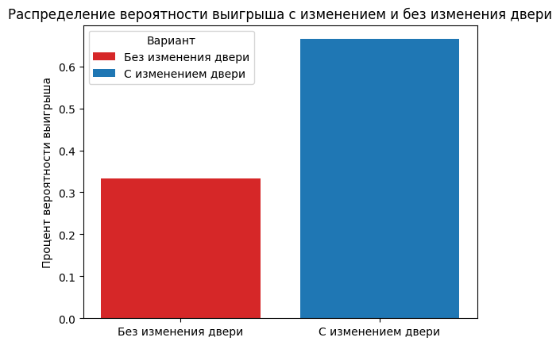

# Описание парадокса Монти Холла и реализация на языке Python

Парадокс Монти Холла — известная задача теории вероятностей. Задача представляет интерес, т.к. её решение, на первый взгляд, противоречит здравому смыслу. Она и правда немного контринтуитивна. Эта задача не является парадоксом в узком смысле этого слова, так как не содержит в себе противоречия. Задача называется парадоксом, потому что её решение может показаться неожиданным. Ниже я постараюсь подробно описать и саму задачу и её решение в классическом варианте.

## Формулировка

Наиболее распространённая формулировка этой задачи, опубликованная в 1990 году в журнале Parade Magazine, звучит следующим образом:

_Представьте, что вы стали участником игры, в которой вам нужно выбрать одну из трёх дверей. За одной из дверей находится автомобиль, за двумя другими дверями — козы. Вы выбираете одну из дверей, например, номер 1, после этого ведущий, который знает, где находится автомобиль, а где — козы, открывает одну из оставшихся дверей, например, номер 3, за которой находится коза. После этого он спрашивает вас — не желаете ли вы изменить свой выбор и выбрать дверь номер 2? Увеличатся ли ваши шансы выиграть автомобиль, если вы примете предложение ведущего и измените свой выбор?_

## Разбор

Для стратегии выигрыша важно следующее: если игрок меняет выбор двери после действий ведущего, то игрок выигрывает, если изначально выбрал проигрышную дверь. Это произойдёт с вероятностью 2/3, так как изначально выбрать проигрышную дверь можно 2 способами из 3.

Обычно при рассуждают так: ведущий всегда в итоге убирает одну проигрышную дверь, и тогда вероятности появления автомобиля за двумя не открытыми становятся равны 1/2, вне зависимости от первоначального выбора. Но это неверно: хотя возможностей выбора действительно остаётся две, эти возможности (с учётом предыстории) не являются равновероятными. Это так, поскольку изначально все двери имели равные шансы быть выигрышными, но затем имели разные вероятности быть исключёнными.

Этот вывод противоречит интуитивному восприятию ситуации, и благодаря возникающему несоответствию между логическим выводом и ответом, к которому склоняет интуитивное мнение, задача и называется парадоксом Монти Холла.
Важно иметь в виду, что первый выбор двери игроком влияет на то, из каких двух оставшихся дверей будет выбирать ведущий.

Другой способ рассуждения — замена условия эквивалентным. Представим, что вместо осуществления игроком первоначального выбора (пусть это будет всегда дверь № 1) и последующего открытия ведущим двери с козой среди оставшихся (то есть всегда среди № 2 и № 3), игроку нужно угадать дверь с первой попытки, но ему предварительно сообщается, что за дверью № 1 автомобиль может быть с исходной вероятностью (33 %), а среди оставшихся дверей указывается за какой из дверей автомобиля точно нет (0 %). Соответственно, на последнюю дверь всегда будет приходиться 67 %, и стратегия её выбора предпочтительна.

Ещё более наглядное рассуждение — заранее зная полные условия игры (то, что выбор предложат поменять) и заранее с этими условиями согласившись, игрок фактически в первый раз выбирает дверь, за которой приза, по его мнению, нет (и может ошибиться с вероятностью 1/3). Одновременно, косвенно он указывает на оставшиеся две двери, за одной из которых приз, по его мнению, есть, что даёт шанс на выигрыш 2/3. Это эквивалентно игре, в которой ведущий бы в самом начале однократно предлагал игроку исключить одну «лишнюю» дверь и гарантированно открыть две оставшиеся.

Четвёртый вариант: если игрок выбрал автомобиль (вероятность этого 1/3), ведущий обязательно предложит смену, и она ведёт к козе. А если игрок выбрал козу (вероятность 2/3) — то к автомобилю. Отсюда и апостериорные вероятности 1/3, если не сменить, и 2/3, если сменить. А равновероятное открытие левой и правой двери, если игрок всё-таки указал на автомобиль, не даёт извлечь информацию из факта, что открыта левая или правая дверь.

Во вложении прикладываю скрипт. В нём я провожу 100 000 экспериментов. Как можно увидеть, вероятность выиграть с изменением двери 0.665, вероятность выиграть без изменения двери - 0.333. Конечно, каждый раз цифры будут немного меняться, но суть останется той же самой.

